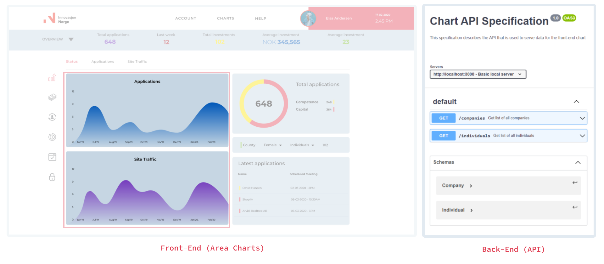

# Gradient Area Charts Full-Stack
> Implement two gradient area charts and a supporting back-end.

- [🚀 Quickstart](#quickstart)
- [🎯 What To Do](#what-to-do)
- [📋 Criteria](#criteria)

<br>

### 🖼️ Visual References

> **Design:** https://xd.adobe.com/view/82ec3234-0ad0-4067-86f2-8d244dcd22c2-d7bf/screen/c044ad23-fcef-4d19-8425-4349310e6b35/specs/ <br> **API:** You can find the OpenAPI specification in `spec/oas.yaml` as well as in the "🖥 Back-End Details" section below.

<br>

### 🚀 Quickstart

1. **Install the dependencies**

   ```shell
   npm install
   ```

2. **Run the project**

   ```shell
   npm start
   ```


<br><details>
  <summary><b>❓ Common Questions</b></summary>
  Common questions and answers for getting started quickly.

  - Q: What should I do? 
  >  - :A Hop down and read the "what to do" section, the specifications, then have a look at the designs and figure out how to best implement these designs into a working prototype of the chart.
  - Where do I find the files for X? 
  >  - Check the section on folder structure, if it is still unclear let us know in the discord.
  - How do I deliver? 
  >  - To deliver your solution you'll have to commit and push the repo, and then go to the Diggit-dashboard for the challenge to submit for evaluation.
  - How do I know if I'm ready to submit? 
  >  - Check the [Evaluation](#-What-will-be-evaluated) criteria section, where it is outlined a few quick questions to answer. If you feel you can answer to the positive on all these then you're probably ready to submit your solution. However you're free to add whatever extra layers of QA on top of these to suit your professional standards. 
  - I'm Stuck, help!
  >  - oof... we don't really do debugging for active challenges, but what we can recommend is that you take the extra time you need. You may just need to take a break, go have a coffee and take a walk. We often find it helps to simply take your mind off the problem for a little while to reboot your angle of approach. Once you come back, check again your progress towards the goals you'll be evaluated on, and see if there is something you hadn't considered before. We wish you the best of luck!
<br></details>

<details>
  <summary><b>📁 Folder Structure</b></summary>
  Here’s an overview of the folder structure. Each element is briefly described.

      ├── api/        # place your ASP.NET Core API in this folder
      ├── public/     # contains the HTML file so you can tweak it, for example, to set the page title and other static files
      ├── spec/       # contains the OpenAPI spec file you can use to build API
      ├── src/        # the main container for your project
      │   │
      │   ├── assets/       # images, icons, colors
      │   ├── components/   # anything that could be a reusable piece of UI lands here
      │   ├── screens/      # each screen is build with multiple components and together they create a screen to display for a user such as Homepage, About, Catalog etc
      │   ├── utls/         # reusable JavaScript functions that support the project such as custom hooks
<br></details><br>

### 🎯 What To Do
> https://www.youtube.com/watch?v=4dfC_rX8eJw

Most of the dashboard is ready. But one important section is missing. Your task is to implement the gradient area charts - the centerpiece of this design. To provide charts with data you will need to create an ASP.NET API server. The openAPI spec has already been provided.

So, in summary:
- Front-end: implement 2 charts that consume external data
- Back-end: build .NET API to serve data for the charts (details below and in "spec" folder)

<br><details>
  <summary><b>🎭 Backstory</b></summary>

  > the story leading up to your challenge

  Innovation Norway is in charge of giving Norwegian ideas global opportunities. They offer critical help and support to startups. Each and every day, both companies and individuals book meetings with their advisors.

  The first step towards better services is a clear overview of current affairs. Innovation Norway needs to see how many companies and individuals they are in contact with. In the future, this dashboard can also show valuable insights such as the overall satisfaction, newly identified opportunities as well as potential efficiency improvements in their processes.<br>
</details>

<details>
  <summary><b>💻 Front-End Details</b></summary>

- **Visual aspects**
  - Target Screen: **1920x1080** (but should work for all common desktop sizes)
  - Font: Montserrat (https://fonts.google.com/specimen/Montserrat)
  - Asset folder: `./src/assets`
  - Colors: check out `./src/assets`
- **Charts**
  - decide on a library you want to use for your implementation
  - review the code base, find a suitable place for the charts
  - build 2 charts ( Individuals and Companies ) around the data provided by the Chart API
  - you are free to be creative with the implementation of the charts, as long as they follow the specifications and designs provided. 
  - remember to include a gradient on the charts, it's a final touch to the project
- **Recommended Libraries**
  - **Charts** - Chart.js; that's what we consider the most convenient one, but feel free to work with any library that works for you!
  - React modules are fine, but for any **CSS logic** - styled-components.
  - Any **custom animation?** - gsap.
<br></details>

<details>
  <summary><b>🎨 Design Details</b></summary>
  
  > Design Handoff: https://xd.adobe.com/view/82ec3234-0ad0-4067-86f2-8d244dcd22c2-d7bf/screen/c044ad23-fcef-4d19-8425-4349310e6b35/specs/
<br>
</details>

<details>
  <summary><b>🖥 Back-End Details</b></summary>

  Please use the latest version of Asp.Net Core for your back-end solution. This is what Innovation Norway uses internally.

  Please create mock/dummy data for your solution. We don't provide you with any data set. This data doesn't have to be perfect. It does however need to follow the provided OpenAPI specification.

  You do not have to create a database for this challenge. Mock/dummy data is sufficient.

- **Chart API**
  - RESTful API built with ASP.NET Core framework
  - Fully complies with OpenAPI spec provided
  - You can add security features (like token auth) for bonus points (not included in OpenAPI spec)


  ### API Specifications 

  This specification describes the API that is used to serve data for the front-end chart

  Base URLs:

  * <a href="http://localhost:3000">http://localhost:3000</a>

  <h2 id="fullstackin-default">ENDPOINTS</h1>


  ### Get list of all companies

  <a id="opIdget-companies"></a>

  `GET /companies`

  Retrieve a list of companies

  > Example response

  ```json
  [
    {
      "id": 1,
      "name": "Google",
      "advisor": "Adam Smith",
      "gender": "male",
      "meetingDate": "2021-10-31"
    },
    {
      "id": 2,
      "name": "Netflix",
      "advisor": "Simen Newton",
      "gender": "female",
      "meetingDate": "2021-04-11"
    }
  ]
  ```

  <h4 id="get-list-of-all-companies-responses">Responses</h3>

  |Status|Meaning|Description|Schema|
  |---|---|---|---|
  |200|[OK](https://tools.ietf.org/html/rfc7231#section-6.3.1)|List of companies|Inline|
  |500|[Internal Server Error](https://tools.ietf.org/html/rfc7231#section-6.6.1)|Something went wrong|None|

  <h4 id="get-list-of-all-companies-responseschema">Response Schema</h3>

  Status Code **200**

  |Name|Type|Required|Restrictions|Description|
  |---|---|---|---|---|
  |*ROOT*|[[Company](#schemacompany)]|true|none|[Model of company entry]|
  |» Company|[Company](#schemacompany)|true|none|Model of company entry|
  |»» id|integer|true|none|Unique identifier for the given company.|
  |»» name|string|true|none|Name of the company|
  |»» advisor|string|true|none|Full name of company's advisor|
  |»» gender|string|true|none|male/female|
  |»» meetingDate|string(date)|true|none|Date|

  ### Enumerated Values

  |Property|Value|
  |---|---|
  |gender|male|
  |gender|female|

  <aside class="success">
  This operation does not require authentication
  </aside>

  ### Get list of all individuals

  <a id="opIdget-individuals"></a>

  `GET /individuals`

  Retrieve a list of individuals

  > Example response

  ```json
  [
    {
      "id": 1,
      "name": "Ivan",
      "surname": "Malkov",
      "gender": "male",
      "meetingDate": "2019-08-24"
    }
  ]
  ```

  <h3 id="get-list-of-all-individuals-responses">Responses</h3>

  |Status|Meaning|Description|Schema|
  |---|---|---|---|
  |200|[OK](https://tools.ietf.org/html/rfc7231#section-6.3.1)|List of individuals|Inline|
  |500|[Internal Server Error](https://tools.ietf.org/html/rfc7231#section-6.6.1)|Something went wrong|None|

  <h3 id="get-list-of-all-individuals-responseschema">Response Schema</h3>

  Status Code **200**

  |Name|Type|Required|Restrictions|Description|
  |---|---|---|---|---|
  |*ROOT*|[[Individual](#schemaindividual)]|true|none|[Model of Individual entry]|
  |» Individual|[Individual](#schemaindividual)|true|none|Model of Individual entry|
  |»» id|integer|true|none|Unique id of a person|
  |»» name|string|true|none|First name of a person|
  |»» surname|string|true|none|Person's surname|
  |»» gender|string|true|none|male/female|
  |»» meetingDate|string(date)|true|none|Date|

  #### Enumerated Values

  |Property|Value|
  |---|---|
  |gender|male|
  |gender|female|

  <aside class="success">
  This operation does not require authentication
  </aside>


  ## Schemas

  <h3 id="tocS_Company">Company</h2>
  <!-- backwards compatibility -->
  <a id="schemacompany"></a>
  <a id="schema_Company"></a>
  <a id="tocScompany"></a>
  <a id="tocscompany"></a>

  ```json
  {
    "id": 0,
    "name": "string",
    "advisor": "string",
    "gender": "male",
    "meetingDate": "2019-08-24"
  }

  ```

  ### Properties

  |Name|Type|Required|Restrictions|Description|
  |---|---|---|---|---|
  |id|integer|true|none|Unique identifier for the given company.|
  |name|string|true|none|Name of the company|
  |advisor|string|true|none|Full name of company's advisor|
  |gender|string|true|none|male/female|
  |meetingDate|string(date)|true|none|Date|

  #### Enumerated Values

  |Property|Value|
  |---|---|
  |gender|male|
  |gender|female|

  <h2 id="tocS_Individual">Individual</h2>
  <!-- backwards compatibility -->
  <a id="schemaindividual"></a>
  <a id="schema_Individual"></a>
  <a id="tocSindividual"></a>
  <a id="tocsindividual"></a>

  ```json
  {
    "id": 0,
    "name": "string",
    "surname": "string",
    "gender": "male",
    "meetingDate": "2019-08-24"
  }

  ```


  ### Properties

  |Name|Type|Required|Restrictions|Description|
  |---|---|---|---|---|
  |id|integer|true|none|Unique id of a person|
  |name|string|true|none|First name of a person|
  |surname|string|true|none|Person's surname|
  |gender|string|true|none|male/female|
  |meetingDate|string(date)|true|none|Date|

  #### Enumerated Values

  |Property|Value|
  |---|---|
  |gender|male|
  |gender|female|

<br></details><br>


### 📋 Criteria
> evaluation, success criteria, quality assurance, qa, etc. - they're all referring to the same thing. This section. 

Your solution will be reviewed by a qualified developer and a qualified designer, just like it would in a normal day-to-day work situation. Below you can find the criteria that together will deterimen your score in the challenge.

#### Design

- **Overall Visual Comparison** (7 points)
  > Does your implementation match with the design hand-off, both in color and general aesthetics?

  <details>
  <summary>More Info</summary>The running version should look as similar to the design as possible. Multiple iterations have been done on the design side in communication with potential users, so it’s paramount that the end result looks as identical to the design as possible.</details><br>

- **Alignment Comparison** (2 points)
  > have you properly aligned your components following the grids and guidelines of the hand-off?

  <details>
  <summary>More Info</summary>Is the page following the same grids and guidelines as the example? Are the different elements placed correctly? This is important to avoid the page being chaotic and to make it look professional.</details><br>

#### Code

- **API Specification Comparison** (9 points)
  > does your implementation follow the API specification?

  <details>
  <summary>More Info</summary>You have been provided with an OpenAPI specification file. Think of it like the design of your API. You should aim to follow this specification perfectly in your implementation. This criteria evaluates how well you've managed to do so.
  
  The OpenAPI Specification, previously known as the Swagger Specification, is a specification for machine-readable interface files for describing, producing, consuming, and visualizing RESTful web services.</details><br>

- **Code Readability** (6 points)
  > is your code easy to understand (i.e. simple naming & syntax) and well presented (i.e. consistent & well documented where needed)?

  <details>
  <summary>More Info</summary>Readability is the ease with which a reader can understand your code. In programming, things such as programmer comments, choice of loop structure, and choice of names can determine the ease with which humans can read computer program code. 

  It is especially important to Innovation Norway that you include lambda expressions - so be sure to include those. In addition, many other modern syntax features improves readability, so try your best to use these where it makes sense.</details><br>

- **Unit & Integration Tests** (4 points)
  > have you added unit and integration tests where it's appropriate?

  <details>
  <summary>More Info</summary>A primary purpose of testing is to detect software failures so that defects may be discovered and corrected. Good tests helps us determine if the code does what it's supposed to do. It also helps protect against side-effects and regressions caused by future refactoring of the codebase.

  We want you to determine, using your own best judgement, where unit and integration tests are appropriate for your implementation. Adding comments in your tests describing shortly why you've decided to test these particular parts of the codebase could help in the review of your work.</details><br>

- **Clear Component Interfaces** (2 points)
  > are your component interfaces logical and well-named, and are they easy for others to build with?

  <details>
  <summary>More Info</summary>Your component interfaces matter. The names you choose for props, their descriptions and the default values all help to make it easier for other developers to build with your components.</details><br>
